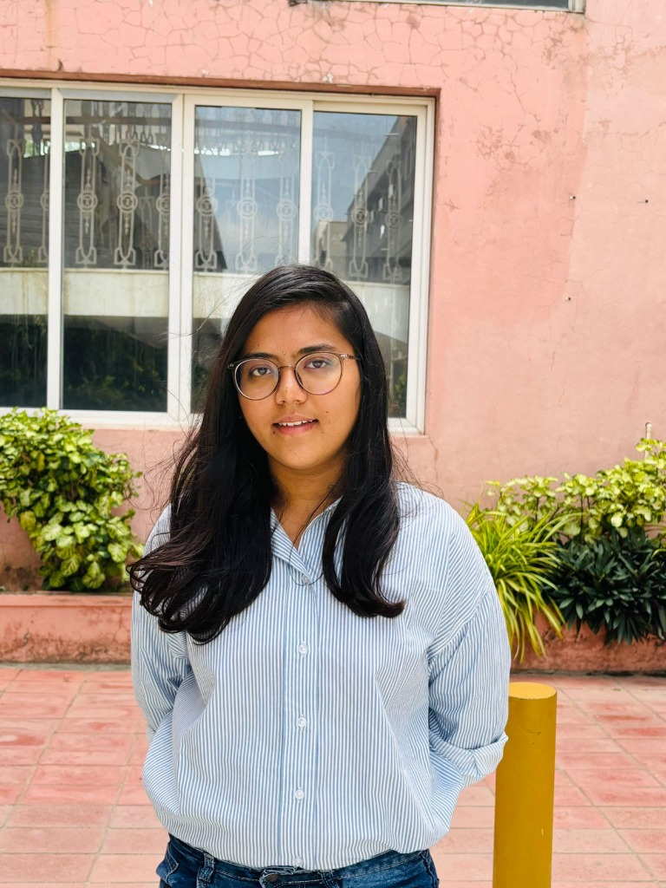

# Sathwika Reddy - Personal Portfolio Website

A clean, minimal, and modern personal portfolio website for **Sathwika Reddy**, a 4th-Year B.Tech Computer Science & Engineering (AI & ML) student at **Guru Nanak Institute of Technology (GNIT)**.

---

## 📋 Table of Contents
1. [Project Overview](#-project-overview)
2. [Folder Structure](#-folder-structure)
3. [How to Run Locally](#-how-to-run-locally)
   - [Method 1: Direct File Open (Easiest)](#method-1-direct-file-open-easiest)
   - [Method 2: VS Code Live Server (Recommended)](#method-2-vs-code-live-server-recommended)
   - [Method 3: Using Python HTTP Server](#method-3-using-python-http-server)
   - [Method 4: Using Node.js / NPX](#method-4-using-nodejs--npx)
4. [How to Customize](#-how-to-customize)
   - [1. Adding Your Profile Photo](#1-adding-your-profile-photo)
   - [2. Adding Your PDF Resume](#2-adding-your-pdf-resume)
   - [3. Updating Projects or Skills](#3-updating-projects-or-skills)
   - [4. Updating Contact Links](#4-updating-contact-links)
5. [How to Deploy for Free](#-how-to-deploy-for-free)
   - [Deploying to GitHub Pages](#option-a-github-pages-recommended)
   - [Deploying to Netlify / Vercel](#option-b-netlify--vercel)
6. [Tech Stack](#-tech-stack)

---

## 🌟 Project Overview

- **Aesthetic:** Minimalist, student/developer focused, high-contrast dark text on off-white background with subtle royal blue accents (`#2563eb`).
- **Performance:** Lightweight, zero heavy framework dependencies, pure HTML5, CSS3, and modern JavaScript.
- **Features:**
  - Sticky navigation bar with scroll blur and active link tracking.
  - Responsive layout (Desktop, Tablet, and Mobile).
  - Project category filter tabs (AI & Machine Learning, NLP, Web).
  - Resume preview modal and one-click download.
  - Interactive contact form with client-side feedback.
  - Direct links to GitHub, LinkedIn, and Email.

---

## 📂 Folder Structure

```text
Portfolio/
├── index.html          # Main HTML structure and content
├── styles.css          # Design system, layout, typography, and responsive CSS
├── script.js           # Navigation, filters, modal, and interactive logic
├── assets/             # Directory for images and documents
│   ├── README.txt      # Asset replacement guide
│   ├── profile.jpg     # (Place your profile picture here)
│   └── resume.pdf      # (Place your PDF resume here)
└── README.md           # Instructions and documentation
```

---

## 🚀 How to Run Locally

You can run this project using any of the methods below:

### Method 1: Direct File Open (Easiest)
1. Open File Explorer on your computer.
2. Navigate to your project folder: `c:\Users\deras\OneDrive\Desktop\Portfolio`
3. Double-click on `index.html` to open it in your default browser (Chrome, Edge, Firefox, Brave, etc.).

---

### Method 2: VS Code Live Server (Recommended for Editing)
1. Open the `Portfolio` folder in **Visual Studio Code** or your IDE.
2. If you have the **Live Server** extension installed:
   - Right-click anywhere in `index.html` and select **"Open with Live Server"**, or
   - Click **"Go Live"** in the bottom status bar of VS Code.
3. The browser will automatically open at `http://127.0.0.1:5500/index.html` with live-reloading as you make edits.

---

### Method 3: Using Python HTTP Server
If you have Python installed:
1. Open PowerShell or Command Prompt in the `Portfolio` folder.
2. Run the following command:
   ```bash
   python -m http.server 8000
   ```
3. Open your browser and go to:
   ```text
   http://localhost:8000
   ```
4. Press `Ctrl + C` in the terminal when you want to stop the server.

---

### Method 4: Using Node.js / NPX
If you have Node.js installed:
1. Open terminal in the project directory.
2. Run:
   ```bash
   npx serve .
   ```
3. Open the local URL provided in the terminal output (e.g., `http://localhost:3000`).

---

## ✏️ How to Customize

### 1. Adding Your Profile Photo
1. Save your portrait/headshot picture into the `assets` folder as `profile.jpg` (or `profile.png`).
2. Open `index.html` and locate the `<div class="profile-image-wrapper">` section (around line 90).
3. Replace the placeholder box with your image tag:
   ```html
   
   ```

### 2. Adding Your PDF Resume
1. Place your resume PDF in the `assets/` folder (for example `assets/Sathwika_Reddy_Resume.pdf`).
2. In `index.html`, find the modal download button (around line 530) and set its `onclick` or link:
   ```html
   <a href="assets/Sathwika_Reddy_Resume.pdf" download class="btn btn-primary">
     <i data-lucide="download"></i>
     <span>Download PDF</span>
   </a>
   ```

### 3. Updating Projects or Skills
- **Projects:** Open `index.html` and scroll to `<section id="projects">`. Each project is an `<article class="project-card">` with clear data attributes (`data-category="ai-ml"`, `data-category="nlp"`, or `data-category="web"`). You can edit titles, bullet points, tech stack tags, and GitHub URLs.
- **Skills:** Scroll to `<section id="skills">` in `index.html` to add or modify skill chips and proficiency levels.

### 4. Updating Contact Links
- In `index.html`, search for `sathwikareddydera@gmail.com`, `linkedin.com/in/sathwikareddydera`, or `github.com/derasathwikareddy06-star` to update any social or email addresses.

---

## 🌐 How to Deploy for Free

### Option A: GitHub Pages (Recommended)
1. Initialize git and push your repository to your GitHub account (`https://github.com/derasathwikareddy06-star/portfolio`):
   ```bash
   git init
   git add .
   git commit -m "Initial portfolio commit"
   git branch -M main
   git remote add origin https://github.com/derasathwikareddy06-star/portfolio.git
   git push -u origin main
   ```
2. On GitHub, go to your repository **Settings** > **Pages**.
3. Under **Branch**, select `main` and root `/`, then click **Save**.
4. Your website will be live in ~1 minute at `https://derasathwikareddy06-star.github.io/portfolio/`.

### Option B: Netlify / Vercel
1. Go to [Netlify.com](https://www.netlify.com/) or [Vercel.com](https://vercel.com/).
2. Sign in with GitHub.
3. Select your `portfolio` repository or simply drag and drop the `Portfolio` folder into the Netlify dashboard.
4. It will immediately publish your website with a free HTTPS URL.

---

## 🛠️ Tech Stack

- **Markup:** HTML5 (Semantic & Accessible)
- **Styling:** Vanilla CSS3 (Custom properties / design tokens, Flexbox & CSS Grid, zero heavy frameworks)
- **Scripting:** Vanilla JavaScript (ES6+)
- **Icons:** [Lucide Icons](https://lucide.dev/)
- **Typography:** [Inter](https://fonts.google.com/specimen/Inter) & [JetBrains Mono](https://fonts.google.com/specimen/JetBrains+Mono) from Google Fonts

---

## 📄 License
Designed & Developed by **Sathwika Reddy**. Open for personal and educational portfolio use.
